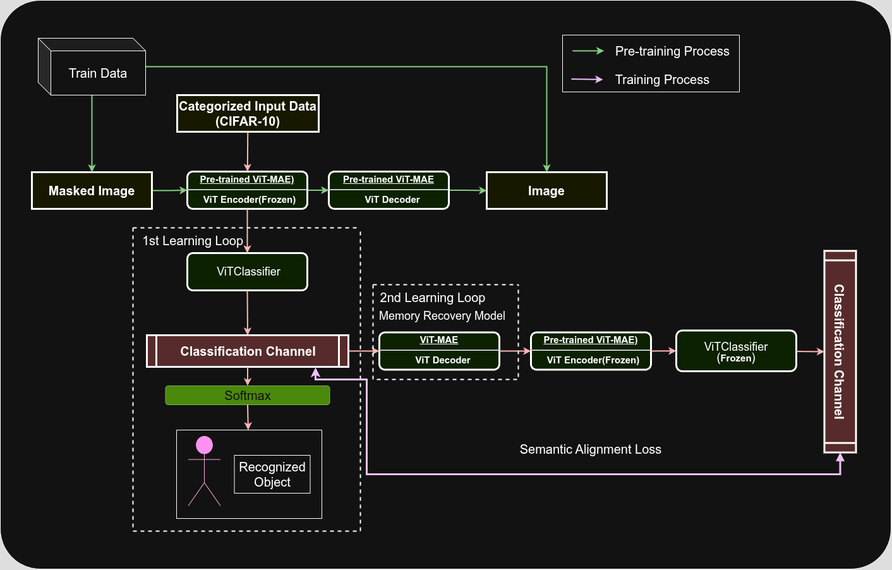

# Weight Memory: Learned Weights for Inferring Training Data Characteristics

## Overview

This repository explores the hypothesis that deep learning model weights can serve as an integrated memory structure. Specifically, it investigates whether learned parameters from transformer-based autoencoders implicitly encode logical and semantic structures from training data.

By training Vision Transformer (ViT) based autoencoders (e.g., ViT-MAE) on various datasets, the project aims to:

1. **Demonstrate** that learned weights can represent structured logical or semantic concepts.
2. **Develop** methods to quantify and extract these implicit representations.
3. **Explore** the implications for cognitive science, neuroscience, and artificial intelligence.

## Current Progress

* [x] Implemented basic classification training and evaluation scripts for ViT-MAE using CIFAR-10.
* [ ] Designing quantitative experiments to verify the logical structure representation capabilities of learned weights.
* [ ] Drafting mathematical frameworks to transform learned weights into logical vector spaces.

## Objectives

* **Train and fine-tune** transformer-based autoencoder models (e.g., ViT-MAE).
* **Systematically verify** whether logical structures or procedural reasoning can be encoded in learned weights.
* **Propose and validate** mathematical frameworks converting learned weight spaces into interpretable logical or semantic vector spaces.

## Current Implementation

* Utilizing Hugging Face Transformers (ViT-MAE) for classification tasks on CIFAR-10.
* Training scripts with validation and best-model saving strategies.
* Optimized GPU usage through efficient data loading and CUDA configurations.

## Architecture Diagram

The following diagram illustrates the conceptual structure and training loops of the proposed model:



* **Pre-training Process (Green arrows)**: Processes original and masked image data using pre-trained ViT-MAE encoder and decoder.
* **Training Process (Purple arrows)**: Two-step training loop first performs classification on masked images, then trains a decoder to reconstruct original logical representations from the learned classification.

  * **1st Learning Loop**: Image classification using ViTClassifier.
  * **2nd Learning Loop (Memory Recovery Model)**: Captures the response characteristics of the learned network to reference inputs, focusing on condensed weight changes for efficiency.

## Future Directions

* Develop comprehensive mathematical models linking deep learning weights to logical structures.
* Collaborate with mathematicians and neuroscientists to refine theoretical frameworks.
* Explore potential applications in explainable AI, cognitive modeling, and philosophy of logic.

## Setup and Usage

Clone the repository and set up the environment:

```bash
git clone https://github.com/shim9610/weight_memory.git
cd weight_memory
python -m venv .venv
source .venv/bin/activate
pip install -r requirements.txt
```

Run the training script:

```bash
python main.py
```

## License

This repository is licensed under the Apache License 2.0, based on Hugging Face Transformers ([https://github.com/huggingface/transformers](https://github.com/huggingface/transformers)). All modifications and additions follow the same Apache License 2.0.

---

# Weight Memory: 학습된 가중치 기반 학습 데이터 특성 추론

## 개요

이 저장소는 딥러닝 모델의 학습된 가중치가 통합적인 메모리 구조 역할을 할 수 있다는 가설을 탐구합니다. 트랜스포머 기반 오토인코더의 학습된 가중치가 학습 데이터의 논리적, 의미적 구조를 암묵적으로 인코딩할 수 있는지 조사합니다.

Vision Transformer(ViT) 기반의 오토인코더(ViT-MAE 등)를 활용하여 다음 목표를 수행합니다:

1. 학습된 가중치가 구조화된 논리적 혹은 의미적 개념을 표현할 수 있는지 **입증**합니다.
2. 이러한 암묵적 표현을 정량화하고 추출하는 방법을 **개발**합니다.
3. 인지과학, 신경과학 및 인공지능 분야에 대한 시사점을 **탐구**합니다.

## 현재 진행 상황

* [x] CIFAR-10을 활용한 ViT-MAE 모델의 기본적인 분류 학습 및 평가 코드 구현
* [ ] 학습된 가중치 내 논리적 표현 능력의 정량적 실험 설계
* [ ] 학습된 가중치를 논리적 벡터 공간으로 변환하는 수학적 프레임워크 초안 작성

## 주요 목표

* 트랜스포머 기반 오토인코더 모델(ViT-MAE 등)의 **학습과 파인튜닝**.
* 학습된 가중치 내 논리 구조나 절차적 추론 능력이 인코딩될 수 있는지 **체계적으로 실험**.
* 학습된 가중치 공간을 해석 가능한 논리적, 의미적 벡터 공간으로 변환하는 수학적 프레임워크를 **제안 및 검증**.

## 현재 구현

* Hugging Face Transformers를 사용하여 CIFAR-10 데이터셋에서 ViT-MAE 모델을 활용한 분류 작업 수행.
* 검증 및 최적 모델 저장 전략 포함.
* 효율적인 데이터 로딩과 CUDA 설정으로 GPU 활용 최적화.

## 아키텍처 다이어그램

제안된 모델의 개념적 구조와 학습 루프는 다음 다이어그램에서 확인할 수 있습니다:


* **사전 학습 과정 (초록색 화살표)**: 사전 학습된 ViT-MAE 인코더 및 디코더를 이용하여 원본 이미지와 마스크된 이미지 처리.
* **학습 과정 (보라색 화살표)**: 마스크된 이미지의 분류를 수행한 후, 분류 결과로부터 원본 데이터의 논리적 표현을 복원하는 두 단계의 학습 루프.

  * **1차 학습 루프**: ViTClassifier를 통한 이미지 분류.
  * **2차 학습 루프 (메모리 회복 모델)**: 레퍼런스 입력에 대한 네트워크의 응답 특성을 보고하며, 가중치의 통합적 변화만 축약하여 효율성을 확보.

## 향후 연구 방향

* 딥러닝 가중치를 논리적 구조와 연결하는 수학적 모델 개발.
* 수학자, 신경과학자와 협력하여 이론적 프레임워크 개선.
* 설명 가능한 AI, 인지 모델링, 논리 철학의 응용 탐구.

## 설치 및 사용법

저장소를 클론하고 환경 설정:

```bash
git clone https://github.com/shim9610/weight_memory.git
cd weight_memory
python -m venv .venv
source .venv/bin/activate
pip install -r requirements.txt
```

학습 스크립트 실행:

```bash
python main.py
```

## 라이센스

본 저장소는 Hugging Face Transformers를 기반으로 Apache License 2.0을 따릅니다. 모든 수정과 추가 내용 또한 동일 라이센스를 따릅니다.
